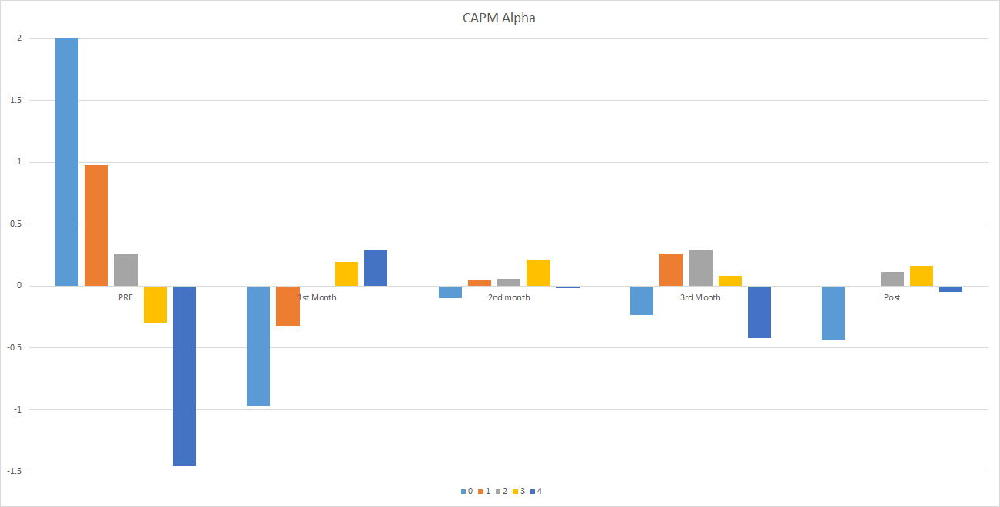
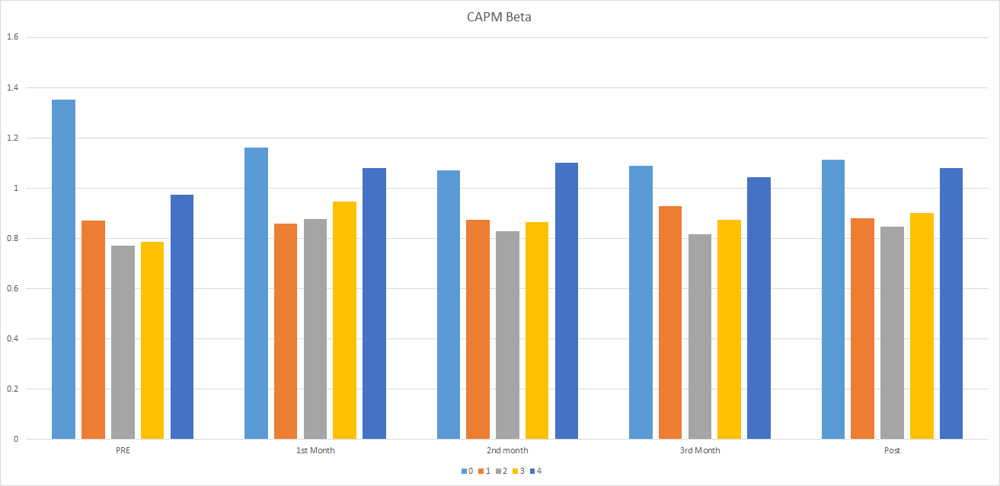
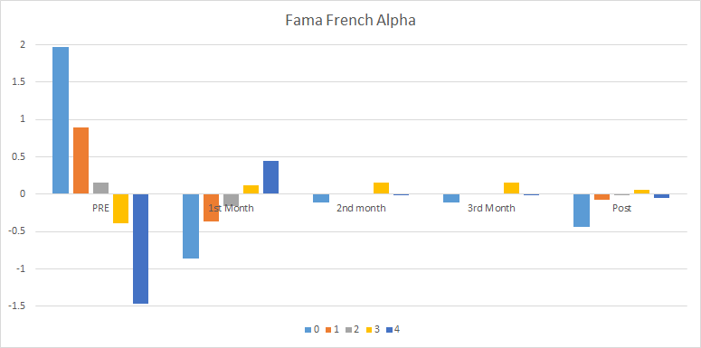
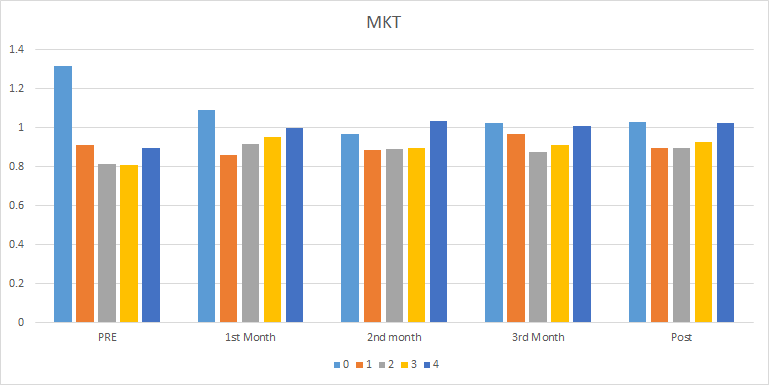
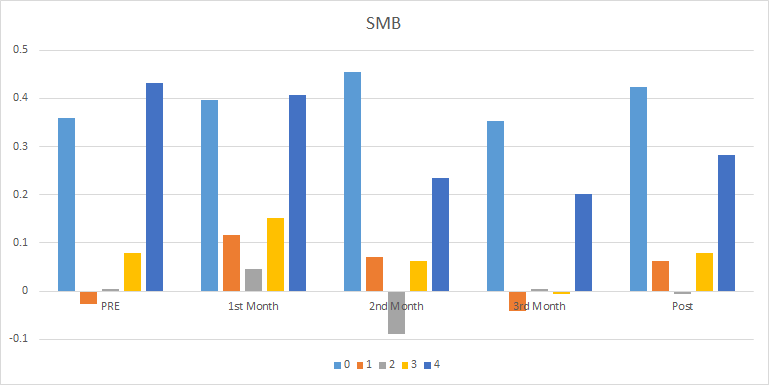
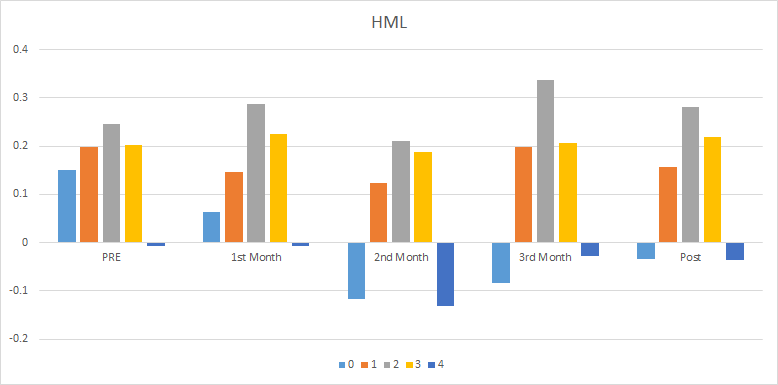

# Key (or New) Results

Empirical Exercise: . After forming the portfolio using the last 3 months, I create quintile portfolios based on the lambdas (I am doing the post-formation exercise). 

Post-formation results are reported below. I first report the realized return and realized volatilities for the months. I then report the time-series alpha, either using a CAPM or a 3-factor Fama French model. Month 1 indicated the first month after formation. Month 2 and Month 3 indicate the second and third month after formation (i.e. second and third month in the next quarter).

Key observations:

* For the first next month in the next quarter, I see a big reversal, with a really big Alpha spread of 1.3 percent on a monthly basis (This is almost 16% on an annual basis!) (-1% for lambda = 0 and 0.3% for lambda = 4). 
* This alpha spread disappears in month 2 and month 3 of the same quarter. 
* Including benchmark in the portfolio optimization can erode alpha (see Fama French section). Results are consistent if we exclude benchmark: LONG high lambda and SHORT low lambda leads to positive alpha. 
* The loadings of the portfolios on the SMB, HML, MKT are similar both for pre-formation and post-formation, suggesting that cross-section in lambdas are capturing something else not captured by variation of the Fama French loadings.

**Hypothesis**: I predict that lambda captures the (institutional) demand for stocks. On average, all funds are trying to include assets with high alpha in their portfolios. Given data on previous months, funds estimate some sort of factor model (CAPM, Fama French) to find which stocks are likely to have high alpha. These stocks with high alpha are stocks with $$ \lambda = 0$$ (or equivalently, low $$\lambda$$) in my model. If all funds are demanding stocks with low $$\lambda$$, these stocks have high demand shocks, causing them to be overpriced in the next period. Stocks with high $$\lambda$$, on the other hand, have negative demand shocks, causing them to be underpriced next period (i.e. have high alpha next period). My results below are consistent with this hypothesis. My argument is also in line with a shifting demand from negative alpha stocks to positive alpha stocks. If funds don't consider that other funds are doing the same thing, then they believe that there is no individual price effect. However, since other funds are in fact doing the same thing, we have an aggregate price effect through the $$ \lambda$$ channel, (i.e. there is coordination failure between funds).

D. also mentioned that this might be related to slow moving capital (need to review literature why?).

## CAPM as a Riskmodel

Here are the realized returns and realized volatility

|                 | Realized Return |         |         |                |
| --------------- | --------------- | ------- | ------- | -------------- |
| ranks           | month 1         | month 2 | month 3 | Average Return |
| 0               | 0.20            | 0.93    | 0.50    | 0.55           |
| 1               | 0.64            | 0.96    | 0.95    | 0.85           |
| 2               | 0.97            | 0.94    | 0.93    | 0.95           |
| 3               | 1.22            | 1.12    | 0.75    | 1.03           |
| 4               | 1.40            | 1.03    | 0.30    | 0.91           |
| rank 4 - rank 0 | **1.21**        | 0.10    | -0.20   | 0.37           |

|       | Realized Return Vol |         |         |             |
| ----- | ------------------- | ------- | ------- | ----------- |
| ranks | month 1             | month 2 | month 3 | Average Vol |
| 0     | 7.73                | 6.78    | 5.87    | 6.83        |
| 1     | 4.94                | 4.36    | 4.06    | 4.46        |
| 2     | 4.75                | 3.95    | 3.51    | 4.09        |
| 3     | 5.24                | 4.17    | 3.70    | 4.41        |
| 4     | 6.47                | 5.94    | 4.75    | 5.77        |

### Alphas, Including Benchmark

|                  | CAPM Alpha (With Bmk) |         |         |
| ---------------- | --------------------- | ------- | ------- |
| ranks            | month 1               | month 2 | month 3 |
| 0                | -0.97                 | -0.09   | -0.23   |
| 1                | -0.32                 | 0.05    | 0.27    |
| 2                | -0.01                 | 0.06    | 0.29    |
| 3                | 0.19                  | 0.22    | 0.08    |
| 4                | 0.29                  | -0.02   | -0.42   |
| rank 4 -  rank 0 | **1.26**              | 0.08    | -0.19   |

Alpha

MKT

SMB

HML

|                 | Fama-French Alpha (With Bmk) |         |         |
| --------------- | ---------------------------- | ------- | ------- |
| ranks           | month 1                      | month 2 | month 3 |
| 0               | -0.85                        | -0.11   | -0.34   |
| 1               | -0.37                        | 0.01    | 0.20    |
| 2               | -0.16                        | 0.00    | 0.15    |
| 3               | 0.12                         | 0.15    | 0.00    |
| 4               | 0.45                         | 0.00    | -0.49   |
| rank 4 - rank 0 | **1.30**                     | 0.11    | -0.15   |

### Alphas, excluding Benchmark

|                 | CAPM Alpha (without Bmk) |         |         |
| --------------- | ------------------------ | ------- | ------- |
| ranks           | month 1                  | month 2 | month 3 |
| 0               | -1.01                    | -0.12   | -0.17   |
| 1               | -0.34                    | 0.10    | 0.27    |
| 2               | -0.01                    | 0.16    | 0.35    |
| 3               | 0.04                     | 0.26    | 0.08    |
| 4               | 0.40                     | -0.10   | -0.48   |
| rank 4 - rank 0 | **1.40**                 | 0.02    | -0.31   |

|                 | Fama-French Alpha (without  Bmk) |         |         |
| --------------- | -------------------------------- | ------- | ------- |
| ranks           | month 1                          | month 2 | month 3 |
| 0               | -0.74                            | -0.17   | -0.37   |
| 1               | -0.33                            | 0.05    | 0.20    |
| 2               | -0.12                            | 0.11    | 0.23    |
| 3               | -0.07                            | 0.19    | 0.02    |
| 4               | 0.49                             | -0.11   | -0.54   |
| rank 4 - rank 0 | **1.23**                         | 0.06    | -0.17   |

## Fama-French as a Risk Model

Here are the realized returns and realized volatilities of the portfolio when we take the Fama-French as a risk Model.

|                 | Realized Return |         |         |                |
| --------------- | --------------- | ------- | ------- | -------------- |
| ranks           | month 1         | month 2 | month 3 | Average Return |
| 0               | 1.08            | 0.93    | 0.52    | 0.85           |
| 1               | 1.06            | 1.09    | 0.96    | 1.04           |
| 2               | 0.97            | 1.07    | 1.10    | 1.04           |
| 3               | 1.23            | 1.01    | 0.95    | 1.06           |
| 4               | 1.15            | 0.55    | 0.75    | 0.82           |
| rank 4 - rank 0 | **0.07**        | -0.38   | 0.23    | -0.03          |

|       | Realized Return Vol |         |         |             |
| ----- | ------------------- | ------- | ------- | ----------- |
| ranks | month 1             | month 2 | month 3 | Average Vol |
| 0     | 5.52                | 4.87    | 4.45    | 4.96        |
| 1     | 5.11                | 4.33    | 3.96    | 4.48        |
| 2     | 5.55                | 4.62    | 3.89    | 4.72        |
| 3     | 6.13                | 5.21    | 4.40    | 5.28        |
| 4     | 8.02                | 6.66    | 5.74    | 6.86        |

### Alphas, Including Benchmark

|                 | CAPM Alpha (With Bmk) |         |         |
| --------------- | --------------------- | ------- | ------- |
| ranks           | month 1               | month 2 | month 3 |
| 0               | 0.02                  | -0.06   | -0.21   |
| 1               | 0.03                  | 0.15    | 0.26    |
| 2               | -0.11                 | 0.09    | 0.41    |
| 3               | 0.10                  | -0.04   | 0.24    |
| 4               | -0.12                 | -0.62   | -0.03   |
| rank 4 - rank 0 | **-0.14**             | -0.56   | 0.19    |

|                 | Fama-French Alpha (W.   Bmk) |         |         |
| --------------- | ---------------------------- | ------- | ------- |
| ranks           | month 1                      | month 2 | month 3 |
| 0               | -0.03                        | -0.04   | -0.17   |
| 1               | -0.13                        | 0.11    | 0.20    |
| 2               | -0.21                        | 0.03    | 0.26    |
| 3               | 0.20                         | -0.07   | 0.00    |
| 4               | 0.19                         | -0.66   | -0.34   |
| rank 4 - rank 0 | **0.22**                     | -0.61   | -0.17   |

**Alphas, without Benchmark**

|                 | CAPM Alpha (wo Benchmark) |         |         |
| --------------- | ------------------------- | ------- | ------- |
| ranks           | month 1                   | month 2 | month 3 |
| 0               | -0.59                     | 0.24    | -0.02   |
| 1               | -0.05                     | 0.20    | 0.26    |
| 2               | 0.08                      | 0.20    | 0.31    |
| 3               | -0.02                     | -0.15   | 0.14    |
| 4               | 0.06                      | -0.56   | -0.36   |
| rank 4 - rank 0 | **0.65**                  | -0.80   | -0.35   |

|                 | Fama-French Alpha (wo Bmk) |         |         |
| --------------- | -------------------------- | ------- | ------- |
| ranks           | month 1                    | month 2 | month 3 |
| 0               | -0.65                      | 0.16    | -0.11   |
| 1               | -0.16                      | 0.16    | 0.20    |
| 2               | 0.03                       | 0.14    | 0.27    |
| 3               | 0.07                       | -0.18   | 0.11    |
| 4               | 0.29                       | -0.53   | -0.45   |
| rank 4 - rank 0 | **0.94**                   | -0.69   | -0.34   |