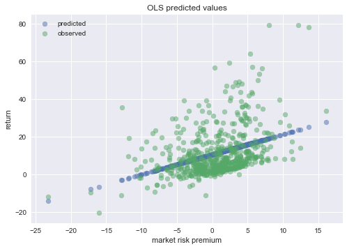

# Robustness Results

Here I discuss results pertaining to several exercises.

* Why were the *ex-ante* alphas so high?
* no benchmark
* Use S&P 500 stocks (roughly 481stocks per month) as the benchmark rather than the CRSP universe (roughly 5000 stocks per month)[^1].
* Use quarter as an investment horizon rather than a month. 

[^1]:The number of stocks in my exercise is not necessarily 500, because my definition of inclusion in the exercise depends on whether a stock has appeared at least 17 times in a given month. In reality, some stocks are included in the S&P500 in the middle of a month and/or excluded from S&P 500 in the middle of the month, causing these stocks to have less than 17 appearances in a month. 

## Why were the Alphas so high?

The alphas were so high ex-ante, because these were realized returns. The stocks that have highest realized return, would have highest beta (assuming positive market risk premium), but also highest alpha. 

For example, using CAPM as the risk model, we find that the average return for rank = 0 as follows:

* The expected return is 5.51% (The expected excess return equals 5.13%)
* The average MKT factor equals : 0.56

The time-series regression that follows:
$$
E[R_i - R_f] = \alpha_i + \beta_i E[R_m - R_f]
$$
is estimated as:
$$
E[R_i - R_f] = 4.41 + 1.28 * E[R_m - R_f]
$$

Since the empirical mean of $$ R_i - R_f$$ equals 5.13, and the empirical mean of Market Excess Returns equals 0.56, this result shows how CAPM is unable to capture the time-series variation of the rank 0 portfolio correctly. 

See figure below: 

## No Benchmark

### CAPM as RiskModel 

(coming-soon)

### Fama French as RiskModel 

### Pre-Formation

(CAPM alpha, and CAPM beta)

| ranks | lm    | #Stocks | Expected Return | Return Vol | Alpha  | MKT   | Idio Vol | R^2   |
| ----- | ----- | ------- | --------------- | ---------- | ------ | ----- | -------- | ----- |
| 0     | 0.000 | 1064    | 11.652          | 12.911     | 10.641 | 1.064 | 11.827   | 0.140 |
| 1     | 0.038 | 963     | 4.173           | 5.356      | 3.340  | 0.845 | 3.780    | 0.502 |
| 2     | 0.064 | 963     | 1.459           | 4.519      | 0.608  | 0.875 | 2.264    | 0.751 |
| 3     | 0.083 | 963     | -0.962          | 4.893      | -1.842 | 0.942 | 2.482    | 0.744 |
| 4     | 0.121 | 963     | -4.962          | 6.484      | -5.928 | 1.133 | 4.055    | 0.611 |

FF3 Alpha and coefficients

| ranks | Alpha  | MKT   | SMB   | HML   | Idio Vol | R^2   |
| ----- | ------ | ----- | ----- | ----- | -------- | ----- |
| 0     | 10.370 | 0.946 | 1.142 | 0.544 | 11.296   | 0.216 |
| 1     | 3.201  | 0.814 | 0.440 | 0.289 | 3.499    | 0.573 |
| 2     | 0.475  | 0.870 | 0.292 | 0.282 | 1.988    | 0.808 |
| 3     | -1.924 | 0.907 | 0.344 | 0.165 | 2.247    | 0.790 |
| 4     | -5.973 | 1.046 | 0.533 | 0.071 | 3.744    | 0.669 |

### Post-Formation

CAPM 

| ranks | lm    | #Stocks | Expected Return | Return Vol | Alpha  | MKT   | Idio Vol | R^2   |
| ----- | ----- | ------- | --------------- | ---------- | ------ | ----- | -------- | ----- |
| 0     | 0.000 | 1067    | 0.432           | 5.098      | -0.393 | 0.900 | 3.171    | 0.618 |
| 1     | 0.038 | 967     | 0.924           | 4.014      | 0.095  | 0.823 | 1.655    | 0.833 |
| 2     | 0.064 | 966     | 0.938           | 4.318      | 0.066  | 0.920 | 1.313    | 0.908 |
| 3     | 0.083 | 966     | 1.122           | 5.070      | 0.146  | 1.081 | 1.519    | 0.911 |
| 4     | 0.121 | 966     | 0.932           | 7.133      | -0.210 | 1.425 | 3.133    | 0.806 |

Fama-French

| ranks | Alpha  | MKT   | SMB    | HML    | Idio Vol | R^2   |
| ----- | ------ | ----- | ------ | ------ | -------- | ----- |
| 0     | -0.456 | 0.863 | 0.315  | 0.122  | 3.027    | 0.652 |
| 1     | 0.036  | 0.846 | 0.008  | 0.135  | 1.612    | 0.841 |
| 2     | 0.024  | 0.947 | -0.047 | 0.099  | 1.273    | 0.914 |
| 3     | 0.135  | 1.074 | 0.060  | 0.020  | 1.509    | 0.912 |
| 4     | -0.204 | 1.355 | 0.334  | -0.037 | 2.968    | 0.826 |

## S&P 500 as a Benchmark

### 

### CAPM as Risk Model

**Pre-Formation** (No Benchmark)

| ranks | lm    | #Stocks | Expected Return | Return Vol | Alpha  | MKT   | Idio Vol | R^2   |
| ----- | ----- | ------- | --------------- | ---------- | ------ | ----- | -------- | ----- |
| 0     | 0.000 | 70      | 4.293           | 7.085      | 3.315  | 1.147 | 4.862    | 0.529 |
| 1     | 0.063 | 103     | 2.406           | 4.753      | 1.523  | 0.936 | 2.299    | 0.771 |
| 2     | 0.135 | 102     | 1.227           | 4.246      | 0.372  | 0.863 | 1.795    | 0.825 |
| 3     | 0.195 | 102     | 0.251           | 4.239      | -0.595 | 0.854 | 1.792    | 0.822 |
| 4     | 0.301 | 102     | -1.219          | 5.231      | -2.176 | 0.943 | 3.107    | 0.651 |

| ranks | Alpha  | MKT   | SMB    | HML   | Idio Vol | R^2   |
| ----- | ------ | ----- | ------ | ----- | -------- | ----- |
| 0     | 3.271  | 1.160 | 0.024  | 0.098 | 4.855    | 0.530 |
| 1     | 1.436  | 1.007 | -0.197 | 0.199 | 2.135    | 0.802 |
| 2     | 0.282  | 0.936 | -0.201 | 0.205 | 1.567    | 0.866 |
| 3     | -0.659 | 0.919 | -0.206 | 0.151 | 1.613    | 0.856 |
| 4     | -2.241 | 0.988 | -0.107 | 0.150 | 3.057    | 0.662 |

**Post-Formation** (No Benchmark)

| ranks | lm    | #Stocks | Expected Return | Return Vol | Alpha  | MKT   | Idio Vol | R^2   |
| ----- | ----- | ------- | --------------- | ---------- | ------ | ----- | -------- | ----- |
| 0     | 0.000 | 70      | 0.741           | 5.392      | -0.116 | 0.964 | 3.288    | 0.633 |
| 1     | 0.063 | 103     | 0.923           | 4.348      | 0.094  | 0.868 | 1.943    | 0.801 |
| 2     | 0.135 | 102     | 0.956           | 4.175      | 0.133  | 0.846 | 1.808    | 0.816 |
| 3     | 0.195 | 102     | 1.020           | 4.395      | 0.136  | 0.905 | 1.694    | 0.852 |
| 4     | 0.301 | 103     | 0.768           | 5.283      | -0.181 | 1.041 | 2.471    | 0.781 |

| ranks | Alpha  | MKT   | SMB    | HML    | Idio Vol | R^2   |
| ----- | ------ | ----- | ------ | ------ | -------- | ----- |
| 0     | -0.151 | 0.989 | -0.055 | 0.086  | 3.274    | 0.636 |
| 1     | 0.040  | 0.930 | -0.195 | 0.139  | 1.798    | 0.829 |
| 2     | 0.061  | 0.928 | -0.255 | 0.187  | 1.526    | 0.869 |
| 3     | 0.105  | 0.961 | -0.211 | 0.091  | 1.541    | 0.878 |
| 4     | -0.175 | 1.060 | -0.103 | -0.004 | 2.452    | 0.785 |

**Pre-Formation** (With Benchmark)

| ranks | lm    | #Stocks | Expected Return | Return Vol | Alpha  | MKT   | Idio Vol | R^2   |
| ----- | ----- | ------- | --------------- | ---------- | ------ | ----- | -------- | ----- |
| 0     | 0.000 | 67      | 3.884           | 7.079      | 2.912  | 1.150 | 4.815    | 0.535 |
| 1     | 0.063 | 103     | 2.312           | 4.729      | 1.437  | 0.922 | 2.314    | 0.762 |
| 2     | 0.136 | 103     | 1.187           | 4.312      | 0.335  | 0.885 | 1.768    | 0.835 |
| 3     | 0.195 | 103     | 0.219           | 4.537      | -0.639 | 0.878 | 2.238    | 0.756 |
| 4     | 0.299 | 103     | -1.250          | 5.282      | -2.191 | 0.971 | 2.980    | 0.682 |

| ranks | Alpha  | MKT   | SMB    | HML   | Idio Vol | R^2   |
| ----- | ------ | ----- | ------ | ----- | -------- | ----- |
| 0     | 2.876  | 1.167 | -0.017 | 0.082 | 4.809    | 0.536 |
| 1     | 1.352  | 0.982 | -0.138 | 0.199 | 2.197    | 0.785 |
| 2     | 0.237  | 0.956 | -0.165 | 0.229 | 1.550    | 0.873 |
| 3     | -0.746 | 0.942 | -0.114 | 0.245 | 2.092    | 0.787 |
| 4     | -2.274 | 1.015 | -0.057 | 0.190 | 2.925    | 0.693 |

**Post-Formation** (With Benchmark)

| ranks | lm    | #Stocks | Expected Return | Return Vol | Alpha  | MKT   | Idio Vol | R^2   |
| ----- | ----- | ------- | --------------- | ---------- | ------ | ----- | -------- | ----- |
| 0     | 0.000 | 67      | 0.729           | 5.359      | -0.133 | 0.974 | 3.161    | 0.656 |
| 1     | 0.063 | 104     | 0.903           | 4.262      | 0.083  | 0.855 | 1.866    | 0.808 |
| 2     | 0.136 | 103     | 0.960           | 4.319      | 0.113  | 0.890 | 1.701    | 0.846 |
| 3     | 0.195 | 103     | 0.976           | 4.609      | 0.081  | 0.958 | 1.711    | 0.863 |
| 4     | 0.299 | 104     | 0.745           | 5.381      | -0.202 | 1.055 | 2.570    | 0.772 |

| ranks | Alpha  | MKT   | SMB    | HML   | Idio Vol | R^2   |
| ----- | ------ | ----- | ------ | ----- | -------- | ----- |
| 0     | -0.149 | 0.994 | -0.063 | 0.042 | 3.152    | 0.658 |
| 1     | 0.043  | 0.917 | -0.228 | 0.108 | 1.700    | 0.841 |
| 2     | 0.057  | 0.962 | -0.247 | 0.147 | 1.456    | 0.887 |
| 3     | 0.051  | 1.011 | -0.204 | 0.085 | 1.573    | 0.884 |
| 4     | -0.202 | 1.064 | -0.044 | 0.004 | 2.567    | 0.773 |

### Fama French  as Risk Model

(Coming soon)

